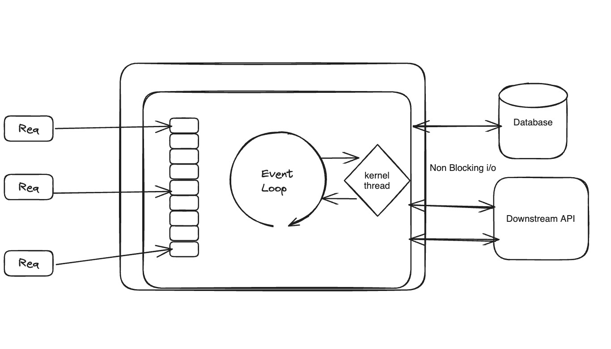

## NODE JS

In this tutorial, I am going to break it down all the important concepts about Node JS in smaller and easy to consumer fashion.

### What is it ?

Node Js is an asynchronous, event driven, non-blocking i/o processing. It get most of the concurrency and ansy from java script single threaded event loop model. It is facinating to think about a single threaded model can scale to support so much parallel processing. Also, if you have more than one core assigned to the app, then you will have create Cluster Module base nodejs app which allows you created multiple workers for multiple CPU core utilization.

### Tradition Web Apps

Traditionally, web apps have threaded pool that serves user request. Everytime the server recieved a request from client, it picks up a thread from the pool and allocate to client requests. Thread will take care of processing, it is sequential processing and syncronous in nature. When there are more than one request, they will pick an available thread from the pool. These can go service the requests as long as the threads are exhausted.  When the resources are used, then incoming request will have to wait for threads to free up whici is oging to slow down drastically. 

This kiinds of processing lacks particulary when the request is waiting for I/O as blocking threads, which use up resorurces and do nothing other than twilding thumbs. 

### Node JS Architecture 

Event loop takes care of basic processing itself, but for async i/o operations, involving module such as fs i/o-heavy and crypto CPU_heavy, it can offload the processing to the worker pool in the system kernel.

Libuv library has worker pool implemented and can spawn and manage multiple threads needed. The thread can run individually and their respective assigned task in a synchronouus manner and return their response to event loop whenevr ready. While the thread work on their assigned operation the event loop can continue operating as usual, concurrently catering to ither requestes. When the threads aredone with their tasks, they can return their output to the event loop, which can then place this back on the execution queue to be executed or returned back to the client.

Complex memory intesive processing can block the main thread and making application unresponsive.
Below are some of the applicaiton that many not be well suited for node js.

Heavy in computation task.

Applications that require access low level system resournces like device drivers.

High frequency trading applications which require precie time based processing.

Not for static content hosting.

Application require=ing control over multi threading.

